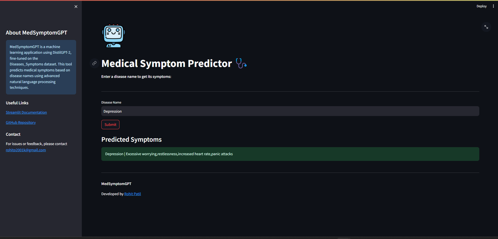

# MedSymptomGPT

MedSymptomGPT is a language model trained to understand and generate medical symptoms based on disease names. It utilizes the GPT-2 architecture and has been fine-tuned on a dataset containing various diseases and their corresponding symptoms.

## Project Overview

MedSymptomGPT is a machine learning application using DistilGPT-2, fine-tuned on the Diseases_Symptoms dataset by QuyenAnhDE. The project includes model training and a Streamlit UI for users to input disease names and receive predicted symptoms interactively, combining NLP techniques with a user-friendly interface.



## Installation and Usage

1. **Clone the Repository:**

    ```bash
    git clone https://github.com/rohitpatill/MedSymptomGPT.git
    cd MedSymptomGPT
    ```

2. **Download Model:**

    Download the model file from [Google Drive](https://drive.google.com/file/d/1Nrs3UL6lhLlbRYKxXPIinIh-2BOCyaY4/view?usp=drive_link) and place it in the main directory alongside other project files.

3. **Run the Application:**

    Use the following command to run the application:

    ```bash
    streamlit run app.py
    ```

    This will start the application, allowing you to interact with the MedSymptomGPT model and generate symptom lists.

---

## About the Model

- **Model Type:** GPT-2
- **Language(s):** English
- **License:** Not specified
- **Finetuned from model:** distilbert/distilgpt2
- **Training Dataset:** `QuyenAnhDE/Diseases_Symptoms`

---
### Model Details

#### Model Description

This is the model card for MedSymptomGPT, a model trained to understand and generate medical symptoms based on disease names. It uses the distilgpt2 architecture and has been fine-tuned on a dataset containing various diseases and their corresponding symptoms. The model is intended to assist in generating symptom lists for given diseases, aiding in medical research and educational purposes.

#### Training Details

- **Training Data:** The model was trained on a dataset containing disease names and their corresponding symptoms. The dataset used for training was `QuyenAnhDE/Diseases_Symptoms`.
- **Training Procedure:**
  - **Preprocessing:** The dataset was preprocessed to combine disease names and symptoms into a single string format.
  - **Hyperparameters:**
    - **Batch size:** 8
    - **Learning rate:** 5e-4
    - **Number of epochs:** 8
  - **Device:** The model was trained on Google Collab.

## Technologies Used

- **Python**
- **Streamlit**
- **Transformers Library (Hugging Face)**
- **Google Collab**
- **PyTorch**
- **pandas**
- **tqdm**

## Bias, Risks, and Limitations

### Recommendations

Users should be aware of the potential biases in the training data, which may lead to biased outputs. It is important to validate the generated content with authoritative medical sources.

### Out-of-Scope Use

This model should not be used for making clinical decisions or providing medical advice. It is intended for educational and research purposes only and should not replace professional medical judgment.

## How to Get Started with the Model

Use the code below to get started with the model:

```python
from transformers import GPT2Tokenizer, GPT2LMHeadModel

tokenizer = GPT2Tokenizer.from_pretrained('RohitPatill/MedSymptomGPT')
model = GPT2LMHeadModel.from_pretrained('RohitPatill/MedSymptomGPT')

input_str = "Kidney Failure"
input_ids = tokenizer.encode(input_str, return_tensors='pt')
output = model.generate(input_ids, max_length=50, num_return_sequences=1)
decoded_output = tokenizer.decode(output[0], skip_special_tokens=True)
print(decoded_output)
```

## Stay Updated

For more information or any future updates regarding the model, follow or keep in touch via the [Hugging Face Model Page](https://huggingface.co/RohitPatill/MedSymptomGPT).

